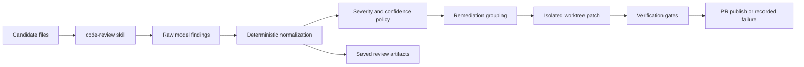

# Flue Code Review Agent

[](https://github.com/shaversj/flue-code-review-agent/actions/workflows/ci.yml)


[](LICENSE)

An agentic code review workflow built with Flue for consistent, high-signal pull request review and bounded remediation planning.

The project demonstrates how a review agent can combine a rubric-driven skill, deterministic normalization, severity policy, saved artifacts, and conservative remediation publishing. The goal is not generic AI commentary. The goal is repeatable review output that engineers can trust.

## Try It

```bash
pnpm install
pnpm run check:types
```

The full review/eval workflow expects saved `.review-runs/` artifacts from local Flue runs. The deterministic typecheck path is the default CI gate.

## What To Notice

- The review skill is a structured playbook, not a free-form prompt.
- Findings are normalized after model output to reduce drift.
- Severity and confidence are treated separately.
- Supported remediation groups are narrow, auditable, and fail closed.
- PR publishing dedupes by hidden remediation-group markers instead of titles.
- Saved run artifacts make review behavior inspectable after the fact.

## Architecture



## Review Flow

1. Collect candidate files with deterministic filtering.
2. Ask the `code-review` skill to inspect only the scoped files.
3. Normalize raw model output into stable findings.
4. Group auto-eligible findings into remediation units.
5. Patch supported groups in isolated worktrees.
6. Verify, publish, reuse an existing PR, or record failure.
7. Save terminal output and review artifacts under `.review-runs/`.

## What To Review

- [.flue/agents/review.ts](.flue/agents/review.ts): main Flue runtime entrypoint.
- [.agents/skills/code-review/SKILL.md](.agents/skills/code-review/SKILL.md): review rubric and output contract.
- [.flue/lib/normalize-review.ts](.flue/lib/normalize-review.ts): deterministic normalization layer.
- [.flue/lib/remediation-groups.ts](.flue/lib/remediation-groups.ts): remediation grouping policy.
- [.flue/lib/remediation-patcher.ts](.flue/lib/remediation-patcher.ts): narrow deterministic patcher.
- [.flue/lib/remediation-executor.ts](.flue/lib/remediation-executor.ts): verification and publish orchestration.
- [example/src/code-with-issues.ts](example/src/code-with-issues.ts): fixture used by review/eval artifacts.

## Review Scope

The agent narrows the review surface before the model sees files.

Excluded by default:

- `dist`
- `node_modules`
- `.git`
- `coverage`
- `.env`
- `.agents`
- `.flue`
- `package.json`

Collected files are further restricted to code-related paths by [.agents/skills/code-review/scripts/collect_files.ts](.agents/skills/code-review/scripts/collect_files.ts).

## Evals And Artifacts

Review runs write artifacts under:

```text
.review-runs/<run-id>/
```

Typical contents:

- `summary.md`
- `data/findings.json`
- `data/report.json`
- `data/collect.json`
- `data/logs/session.log`

Remediation-enabled runs may also include:

- `data/remediation.json`
- `data/remediation-executions.json`

Eval scripts:

```bash
pnpm run eval:golden
pnpm run eval:remediation
pnpm run eval:stability
```

These evals compare saved review-run artifacts. They are intentionally separate from CI because they depend on local review runs rather than static repository fixtures.

## Development Notes

- Keep fixture-specific expectations in evals, not runtime output generation.
- Keep deterministic patching narrow and conservative.
- Prefer fewer high-confidence findings over noisy review breadth.
- Report material correctness, security, reliability, and maintainability issues over style commentary.
